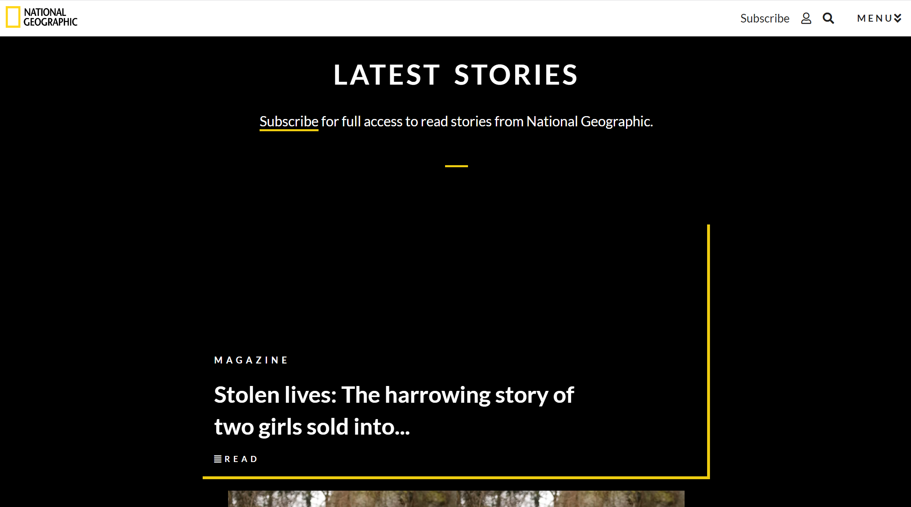

# National Geographic Design Replica

This is a design replica of a National Geographic webpage using HTML and CSS. No installation is required. Open your terminal and type:
$ git clone https://github.com/nathanlucianortiz/natgeo and open with live server. 
As this is an older project before I learned about proper semantic HTML, the headings are incorrectly skipping levels. The current challenge 
is fixing them, while still maintaing the design, as changing the headings leads to a drastic difference in spacing and sizing. 

 

  

  

  

  

  

  

  

